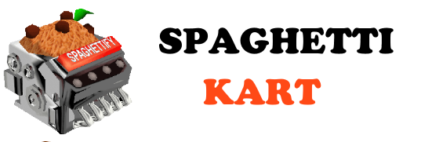

<p align="center">
  <picture>
    <source media="(prefers-color-scheme: dark)" srcset="Assets/spaghettigithubnight.png">
    
  </picture>
</p>

# SpaghettiKartX (Xbox One & Xbox Series X|S Port)

> [!WARNING]  
> **This is a community port of the [original SpaghettiKart PC port](https://github.com/HarbourMasters/SpaghettiKart) specifically geared towards an Xbox One and Xbox Series X|S release via UWP (Universal Windows Platform) in Developer Mode.**  
> Please **DO NOT** open issues on the upstream SpaghettiKart repository or Harbour Masters repositories for any bugs, crashes, or issues you encounter while using or building this Xbox port. Direct all Xbox-related issues to this repository's issue tracker.

**SpaghettiKartX** brings the Harbour Masters SpaghettiKart project — a native PC port of **Mario Kart 64** — to the **Xbox One**, **Xbox Series S**, and **Xbox Series X** family of consoles. It leverages the [n64-decomp/mariokart64](https://github.com/n64-decomp/mariokart64) decompilation, using [libultraship](https://github.com/Kenix3/libultraship) alongside Mesa Gallium OpenGL translation over DirectX 12 for console-native rendering, low-latency SDL2 audio, and native controller input.

Runs natively on **Xbox One**, **Xbox One S/X**, **Xbox Series S**, and **Xbox Series X** via Xbox Developer Mode.

---

## No Copyrighted Assets Included

**None of Nintendo's assets (code, textures, audio, models, text, ROM data) are checked into this repo or distributed with builds.** The port is a pure C/C++ source tree; every byte of Nintendo-owned data must be extracted at build time or first launch from a legally owned US Mario Kart 64 ROM dump (`.z64`) that *you* supply. If you do not own a legal copy of Mario Kart 64 for the Nintendo 64, you cannot build or run this project.

The application includes an integrated, controller-driven **Boot Menu** that automatically prompts you to select and extract your ROM into the required `mk64.o2r` asset archive on first launch.

---

## Installation & Setup (Xbox Dev Mode)

### 1. Requirements
- An Xbox console (Xbox One, Xbox One S/X, Xbox Series S, or Xbox Series X) with **Developer Mode** activated.
- A PC connected to the same local network as your Xbox.
- A clean, legally dumped copy of **Mario Kart 64 (USA)** in `.z64` format (SHA-1: `579C48E211AE952530FFC8738709F078D5DD215E`).

### 2. Deploying to Xbox
1. Power on your Xbox and launch the **Dev Home** dashboard.
2. Note the Windows Device Portal (WDP) URL displayed on the top-right corner of the Dev Home screen (e.g., `https://192.168.1.xxx:11443`).
3. On your PC, open a web browser and navigate to your Xbox's Device Portal URL.
4. Under the **Apps** section, click **Add**.
5. Select `SpaghettiKartX_x64.msix` and deploy the package.

### 3. First Boot & In-App ROM Extraction
1. Launch **SpaghettiKart** from your Xbox dashboard.
2. If `mk64.o2r` has not yet been generated, the **SpaghettiKart Boot Menu** will appear.
3. Place your `Mario Kart 64 (USA).z64` ROM file into `D:\SpaghettiKart\` (via the Device Portal File Explorer under `DevelopmentFiles`) or on an external USB flash drive (`E:\SpaghettiKart\`).
4. Select your ROM and storage destination using the Xbox controller, then choose **Extract**.
5. The extractor will verify your ROM checksum and compile `mk64.o2r` directly on the console (typically takes 1–2 minutes).
6. Once extraction completes, select **Launch Game** to jump straight to the title screen!

---

## Mods & High-Res Textures

SpaghettiKartX features full support for custom assets, character skins, custom courses, and HD texture packs!

1. **High-Res Texture Packs**: Place HD texture `.zip` archives (or loose folders) directly into the `mods/` directory located in your storage root (e.g., `D:\SpaghettiKart\mods\`).
2. **Custom Characters & Tracks**: Drop any packaged `.o2r` mod archives into the `mods/` folder.
3. **Instant Loading**: Installed mods are loaded on game boot.

*Storage directory layout:*
```
D:\SpaghettiKart\
+-- mk64.o2r
+-- spaghetti.o2r
+-- spaghettify.cfg.json
+-- mods/
    +-- hd_textures.zip
    +-- custom_course.o2r
```

---

## Configuration & In-Game Menu

All port enhancements, cheats, gameplay tweaks, and audio controls are accessible via the in-game Port Menu Bar.

- **To toggle the menu**: Press the **View button** (the button with two overlapping squares / Back) on your Xbox controller at any time during gameplay.
- **Controller Navigation**:
  - **D-Pad / Left Stick**: Move cursor between menu items and sliders.
  - **A Button**: Select item, check boxes, or activate toggles.
  - **B Button**: Close open dropdowns or submenus.
- **Key Enhancements**:
  - **60fps Interpolation**: Fluid 60fps racing physics with frame interpolation.
  - **Widescreen Mode**: True 16:9 widescreen presentation.
  - **Audio Controls**: Master, BGM, and SFX volume sliders.
  - **Fast3D Enhancements**: Internal resolution scaling and texture filtering options.

---

## Features & Xbox Optimizations

- **Console-Native Rendering**: Fast3D OpenGL pipeline translated through Mesa Gallium WGL to DirectX 12 for reliable hardware acceleration on Xbox OS.
- **Full Widescreen Support**: Native 16:9 widescreen gameplay, perfectly filling TV screens without stretching.
- **Xbox Controller Integration**: Fully mapped Xbox controller inputs out of the box with seamless menu bar navigation.
- **Auxiliary Storage Manager**: Persistent configurations, save files, logs, and mods routed to console storage (`D:\SpaghettiKart\` or USB drive).
- **Graceful Delay-Loading**: Custom Win32 delay-load thunks prevent Xbox PE loader import errors on desktop-only APIs.

---

## Building from Source

### Prerequisites
- **Visual Studio 2022** with the following workloads installed:
  - *Desktop development with C++*
  - *Universal Windows Platform development* (v143 toolset and Windows 10/11 SDK `10.0.26100.0` or `10.0.19041.0`)
- **CMake** (3.24 or newer)
- **Git**

### Build Commands
1. **Clone the repository and submodules:**
   ```cmd
   git clone --recursive https://github.com/KawaiiBunga/SpaghettiKartX.git
   cd SpaghettiKartX
   ```

2. **Compile the Spaghettify Engine DLL:**
   ```cmd
   msbuild _ref\SpaghettiKart-src\build-win32\Spaghettify.vcxproj /p:Configuration=Release /p:Platform=x64 /m
   ```

3. **Build the SpaghettiKartX UWP MSIX Package:**
   ```cmd
   msbuild SpaghettiKartX.vcxproj /p:Configuration=Release /p:Platform=x64 /p:AppxBundle=Never /m
   ```

4. **Sign the Package:**
   ```cmd
   signtool sign /fd SHA256 /a /f SpaghettiKartX_TemporaryKey.pfx /p SpaghettiKartX AppPackages\SpaghettiKartX\SpaghettiKartX_1.0.10.0_x64_Test\SpaghettiKartX_1.0.10.0_x64.msix
   ```

5. **Deploy to Console:**
   ```cmd
   WinAppDeployCmd install -file "AppPackages\SpaghettiKartX\SpaghettiKartX_1.0.10.0_x64_Test\SpaghettiKartX_1.0.10.0_x64.msix" -ip <your-xbox-ip>
   ```

---

## Credits & Acknowledgements

- **Harbour Masters & Kenix3**: Creators of [SpaghettiKart](https://github.com/HarbourMasters/SpaghettiKart) and [libultraship](https://github.com/Kenix3/libultraship).
- **mk64 Decomp Team**: For the reverse engineering and decompilation of [Mario Kart 64](https://github.com/n64-decomp/mariokart64).
- **SternXD & worleydl**: For the UWP Xbox porting foundation and boot menu architecture from [2Ship2Harkinian-UWP](https://github.com/SternXD/2ship2harkinian-uwp).
